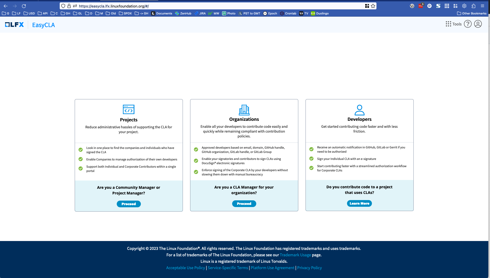

# LandingPage

This is the EasyCLA landing page repository. It is a small single page app which
provides links to the Project Control Center (PCC) for onboarding, the CLA
Corporate console for managers to review and manage their organization's CLA
approval lists, and documentation for the contributor console.



## Development

Requires Node >= 18.

```bash
yarn install          # Install dependencies
yarn serve            # Dev server at http://localhost:8100
yarn test             # Unit tests (Karma + ChromeHeadless)
yarn build            # Build (requires AWS credentials for SSM config prefetch)
```

## License

Copyright The Linux Foundation and each contributor to CommunityBridge.

This project’s source code is licensed under the MIT License. A copy of the license is available in LICENSE.

The project includes source code from keycloak, which is licensed under the Apache License, version 2.0 \(Apache-2.0\), a copy of which is available in LICENSE-keycloak.

This project’s documentation is licensed under the Creative Commons Attribution 4.0 International License \(CC-BY-4.0\). A copy of the license is available in LICENSE-docs.

